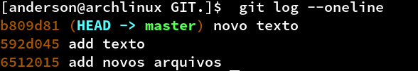
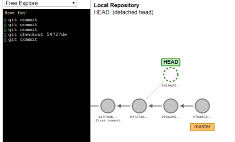
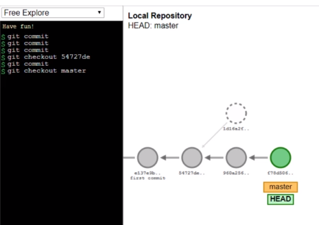
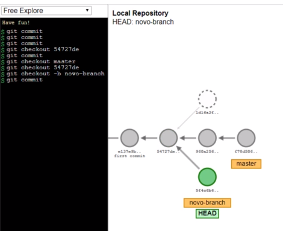
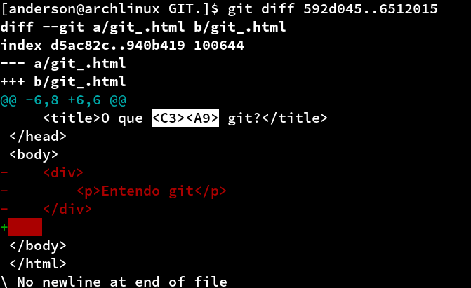

---

</br>

* [Para que serve o Git?](#para-que-serve);  
* [instalação](#instalação);
* [Configurando o  user](#configurando-o-user);
* [O que é repositório?](#o-que-e-repositório)
* [Criando um novo repositório](#criando-um-novo-repositório);
* [Comando Status](#comando-status);
* [Monitorando arquivos](#monitorando-arquivos);
* [Enviando commit](#enviando-commit);
* [Recebendo alterações](#recebendo-alterações); 
* [Histórico de alterações](#histórico-de-alterações); 
* [Git ignore](#git-ignore); 
* [Repositório remoto](#repositório-remoto); 
* [Clonando repositório ](#clonando-repositório); 
* [Branches](#branches):
  * [Unindo trabalhos](#unindo-trabalhos);
  * [Atualizando a branch](#atualizando-a-branch).
* [Resolvendo conflitos](#resolvendo-conflitos);
* [Ctrl Z no Git](#ctrl-z-no-git);
* [Git stash](#git-stash);
* [Voltando para um commit antigo](#voltando-para-um-commit-antigo);
* [Comparando alterações](#comparando-alterações);
* [Tags e releases](#tags-e-releases).

## Para que serve

É comum quando se trabalha com desenvolvimento, trabalhar com mais de uma pessoa e cada uma ter o projeto em sua maquina e que fazem alterações ao logo do desenvolvimento. Quando uma pessoa faz uma alteração no projeto, as outras precisam ser notificadas sobre o enviou dessas alterações, o envio por meios físicos como pendrives não é viável até por que no momento da entrega de uma alteração outra já poderia ter sido feita.

Essa situação poderia trazer alguns problemas durante o desenvolvimento, por isso existi algumas soluções e uma dela é a criação de um servidor local ou remoto como o [GitHub](https://pt.wikipedia.org/wiki/GitHub), específico para o envio das alterações dos arquivos onde a equipe tem acesso.


O servidor precisa ter alguma ferramenta capaz de identificar que a versão enviada não é a mais recente e não permitir o envio do projeto sem antes o usuário baixar a versão atual do projeto já que antes do envio das suas alterações ocorreram uma ou mais alterações. Isso é chamado de controle de versão e é isso que o GIT faz, mas existem outros sistemas de controle de versão como:

* CVS
* SVN
* Mercurial
### Vesionamento de código
   - Controle de histórico
   - Trabalhar com equipe no mesmo projeto
   - Logs detalhados
   - Trabalhar de forma isolada
---
## Instalação 

Para instalar basta acessar o [site oficial](https://git-scm.com/downloads)

```css
Caso você esteja utilizando Linux, algumas distribuições já vêm com o Git instalado, então é só abrir o Terminal e digitar "git  --version" para verificar isto. 

Se ele não estiver instalado, use  o gerenciador de pacotes da sua distribuição.
```

## No Windows
Feito o download, executaremos o arquivo, e durante a instalação, existem algumas opções como o "Git Bash" , que é uma forma de digitar comandos. O Git Bash fornece comandos com os quais quem desenvolve em Linux já está acostumado a usar, como o ls para mostrar arquivos e pastas existentes no diretório atual.

A instalação padrão é clicando em "Next". Em "Adjusting your PATH environment", é possível definir se iremos usar apenas o Git Bash, ou o Git de qualquer outra interface de linha de comando podem deixar padrão caso queira outra opção basta ler atentamente as opções.

Finalizada a instalação, podem desmarcar o box de "View Release Notes” e marcar "Launch Git Bash”, para que se inicie a execução do Git Bash.
para garantir que tudo ocorreu bem no terminal digiti git --version, ao que será retornado git e a versão instalada.

---
## Configurando o  user 

Antes de utilizar o git precisa informa quem é o usuário para que ele possa salvar os dados do autor das alterações.

```css
git config --local user.name "Seu nome aqui"
git config --local user.email "seu@email.aqui"

```
É possível configurar um e-mail e autoria para cada projeto ou para a maquina toda através do comando:

```css

    //configurando para o projeto
    config --local  user.name "seu nome"
    config --local  user.email "seu email"

    // para a maquina toda
    git config --global user.name "seu nome"
    config --local  user.email "seu email"
```
---
## O que e repositório

Local onde estão armazenados os arquivos de seu projeto, quando um projeto é iniciado com git, estamos criando um repositório para aquele projeto. O que permite enviar para alguns servidores específicos como o gitHub.


</br>

---
## Criando um novo repositório

Para inicializar o repositório é preciso criar uma pasta com ou sem um projeto e executar o seguinte comando:

```css
    git init
```


Todas as alterações que forem realizadas no arquivo localizado dentro deste repositório poderão ser mostradas pelo Git com algumas informações como, indicações do que foi modificado, quem modificou e outras.

---
### Comando Status

Para verificar o estado do repositório, ou analisar quais arquivos foram alterados use o comando git status.

```css
  git status
```


Na mensagem será exibido algumas informações como, Untracked files, indica que há arquivos não monitorados no projeto, são arquivos que ainda não foram adicionados para o envio de uma nova atualização "commitar". Para adicionar esse arquivo é preciso utilizar o comando, git add nomeDoArquivo. Caso queira adicionar mais de um arquivo usando só um comando basta no lugar do nomeDoArquivo usar um "." (ponto).


```css
    // add um único arquivo
    git add nomeDoArquivo

    // add vários arquivos
    git add .
```

Ao executar o comando git status obtemos algumas informações como,HEAD, working tree e index e cada uma delas possui uma definição:

- HEAD: Estado atual do código, aponta para o último commit.
- working tree: Local onde os arquivos estão sendo armazenados e editados.
- index: Local onde o Git armazena o que será commitado.

---
## Monitorando arquivos

Caso haja arquivos que nunca foi editado e salvo pelo Git, basta utilizar o comando git add:

```css
    git add nomeDoArquivo

    //Se caso houver mais de um arquivo use com o ponto no final.

    git add .
```

Com isso, se rodar o git status, irá aparecer um retorno, incluindo Changes to committed, isto é, "mudanças a serem commitadas", ou salvas, enviadas.

Para salvar a modificação é preciso rodar o comando git commit, porém, precisamos informar uma descrição de qual modificação estamos fazendo, para isso é necessário incluir o -m no final do comando mais a mensagem.

```css

    git commit -m "mensagem de descrição"
    //A mensagem precisa está entre aspas duplas e deve ser descritiva e curta.

```


Após executar o comando será exibido a mensagem que configuramos e será mostrado quais foram as alterações. Se executarmos git status novamente irá mostrar que não há nada para ser commitado.


Os commites devem ser executados quando houver alterações significativas ou algum ponto que você quer lembrar. Não é recomendado executar o commit quando algo no código não funciona, algumas pessoas defendem o uso do commit apenas no final do expediente outras dizem que devem ser executados  a cada alteração, não existe uma regra, e sim recomendações.

---
## Enviando commit

Para enviar estas alterações ao seu servidor local, execute git push local master, mas se for remoto execute git push origin master, podendo alterar as branch e enviar suas alterações para ele.

```css
    //enviar para servidor local
    git push local master   

   //enviar para repositório 
    git push origin master  
```

---
## Recebendo alterações
Quando estamos trabalhando em equipe em um projeto é comum que as outras pessoas também façam alterações no projeto, com isso sempre antes de começar uma nova alteração é bom baixar a nova versão do projeto com as alterações feitas por outras pessoas, e podemos fazer isso através do comando:

```css
    git pull 
```
---

</br>

## Histórico de alterações

Poderemos verificar o histórico de alterações, cada mensagem de commits feitos, o comando que poderemos utilizar para isto é git log , que nos mostrará diversas informações, sendo o primeiro deles um hash do commit, uma identificação única de cada commit, não existem dois commits com o mesmo hash.
A informação seguinte refere-se ao branch, ou "ramo" em que o commit se encontra. O HEAD e master quer dizer que é o local onde nos encontramos, no código, onde acontecem as alterações que fizemos, e que estamos em um ramo denominado master. Além de informações da autoria do commit, e-mail configurado, data do commit e mensagem.


O comando git log possui algumas variações:

* git log --oneline: exibir as informações por linhas;
* git log -p: exibir mais informações. (para sair da tela use wq)
  
Para filtros em log cheatsheet há vários delas como:

* git log --pretty="format:%H": traz apenas o hash;
* git log --pretty="format:%h %s": traz o hash abreviado seguido pela mensagem do commit.

É possível personalizar o comando de diversas formas de acordo com suas necessidades, é possível acessar mais opções usando o comando git log --help ou acessando [git log cheatsheet](https://devhints.io/git-log).

---
## Git ignore

Quando temos um arquivo no projeto que não desejamos fazer commit podemos ignorar através da criação de um arquivo chamado ".gitignore" dentro da pasta do projeto. Todas as linhas que estiverem dentro dele serão ignoradas pelo git durante o commit, exemplo.
Se quisermos ignorar um arquivo basta abrir o arquivo .gitinore e adicionar o nome do arquivo, se for pasta adicionar o nome da com uma barra no final.


---
</br>

## Repositório remoto

O repositório remoto é um servidor onde podemos enviar alterações e as mesmas ficaram acessíveis para outras pessoas. Para isso é preciso criar uma pasta e pelo terminal acessar a pasta e rodar o comando:

```css
git init

```

Para que o servidor reconheça o repositório precisa seguir alguns passos.
Se for um repositório local, roda o comando mais o caminho do servidor:

```css
git remote add local C:/Users/Documents/git-e-github

```
Se for um repositório em um servidor remoto como o github:

```css
git remote add origin https://github.com/user/repo.git

```
Após executar um dos comandos podemos rodar o comando git remote -v para exibir o endereço local do repositório. Além disso, aparecerá informações como fetch e push:

- fetch: De onde os dados desse caminho serão buscados;
- push: Para onde serão enviados.

---

</br>

## Clonando repositório

É possível clonar o repositório do servidor através do comando git clone mais o caminho do servidor e o nome da pasta que será criada ex:

```css
    git clone C:/Users/Documents/servidor copiaProjeto
```
Quando se trata de um servidor remoto, o comando será esse:

```css
    git clone usuário@servidor:/caminho/para/o/repositório
```

Se for um servidor remoto como o GitHub, git clone + link do repositório:

```css
    git clone https://github.com/andersonzeroone/Git.git
```

Caso a pasta esteja vazia é porque ainda não tive o envio de alterações. Depois dessas alterações enviadas através do commit, basta executar o comando git pull local master.
---
</br>

## Branches

Em um trabalho compartilhado com vários usuários trabalhando no mesmo projeto e em partes diferentes e o master compartilhado entre eles, para evitar complicações é interessante ter uma maneira de separar em ramos de desenvolvimento(branches) para saber exatamente no que cada um está trabalhando.
Para criar uma brache execute o comando, git branch nomeDaBranche, que criará este branch, embora tenha que mudar para ela manualmente, com git checkout nomeDaBranch. É possível criar uma branch e acessar diretamente usando git checkout -b nomeDaBranch.Para remover a branch git branch -d nomeDaBranch.


```css

    //criar branch
    git branch nomeDaBranche

    //acessar branch
    git checkout titulo

    //criar e acessar diretamente
    git checkout -b nomeDaBranch

    //remover branch
    git branch -d nomeDaBranch

```

### Unindo trabalhos

É possível unir as ramificações (branch) do projeto através do comando git merge nomeDaBranch assim que ela ou outra branch esteja finalizada, ou feita alguma correção.

O merge "puxa" os conteúdos de uma branch para outra, ou seja antes de rodar o comando você precisa está na sua branch principal.

EX: vamos unir a branch title na branch master (principal).

<!--  -->

```css
    //acessar branch master
    git checkout master

    //Se tiver dúvidas em que branch está rode o comando git status para verificar.

    //fazendo o merge 
    git merge title
```
---
</br>

### Atualizando a branch
Durante a atualização da branch podem gerar um commit a mais e dependendo da estratégia utilizada para gerar os commits, podem poluir o histórico de commits. Por isso, é preciso atualizar a branch master com os commits de outras branch usando o comando git rebase nomeDaBranch. O comando git rebase atualiza a branch e junta as branch gerando apenas um commit de junção.

É possível fazer um teste no [Visualizing Git](https://git-school.github.io/visualizing-git/#free) seguindo alguns passos:


```css
    clear
    // caso não tenha a branch criada execute:  git branch titulo
    git checkout -b titulo
    git commit -m "teste1"
    git commit -m "teste2"
    git checkout master
    git rebase titulo
    git log

```
Resultado.


---

</br>

## Resolvendo conflitos

No momento de executar o comando git merge se houver conflitos é recomendado corrigir primeiramente os conflitos e depois realizar o commit.

</br>

</br>

Já no código irá aparecer linhas como <<<<<<< HEAD (Current Change) e =======, onde estão o atual commit no master. E ======= e >>>>>>> lista (Incoming Change), são os dados que estamos tentando trazer da branch lista. Ou seja, é exibida exatamente a diferença entre ambos. E o que precisamos fazer para corrigir este conflito é remover as informações indesejada

</br>

</br>

Após editar e salvar o arquivo execute o git status para verificar as informações dos arquivos modificados e em seguida executar git add nomeDoArquivo ou git add . (para vários arquivos) e depois o git commit para que o commit de merge seja realizado para enviar os arquivos execute git push local master ou git push origin master (servidor remoto).

---

</br>

## Ctrl Z no Git

#### Desfazer alterações em arquivos não marcados para commit (git add).
Quando queremos desfazer alguma ação no git é preciso verificar algumas situações como por exemplo, se tem algo marcado para commit através do git add. Se ainda não foi utilizado o git add para commitar o arquivo basta utilizar o comando:

```css
    git checkout -- nomeDoArquivo
```

#### Desfazer alterações em arquivos marcados para commit (git add).
Para desfazer modificações que foram marcadas para commit usando o git add.  Use o comando git checkout HEAD -- nomeDoArquivo, o HEAD indica para qual estado voltará o arquivo, nesse caso voltará para o local onde estava trabalhando, se executar o git status irá verificar que não possui arquivos a serem comitados. Comando:

```css
    git checkout HEAD -- nomeDoArquivo
```

#### Desfazer alterações em arquivos depois do commit.

Para desfazer alterações que sofreram commit é necessário identificar o hash(identificação única) do commit através do comando git log, após copiar a hash , use juntamente com o comando git revert use a hash dessa forma será criado um commit com as alterações desfeitas.

```css
    git revert b809d819c15f49bc6f40f79c5ea7986c8616f992 
```

---
</br>

## Git stash

No git é possível salvar um ponto de alteração temporário sem necessidade de commit, podendo salvar uma parte do projeto e da continuidade em outro ponto. Isso devido a um conceito chamado Stash, com ele conseguimos salvar todas as alterações em um local temporário sem precisar de um commit. O stash possui alguns comandos como:

Salvar as alterações em um local temporário:
```css
    git stash  
```

Mostrar a lista de pontos salvos:
```css
    git  stash list 
```

Para voltar a trabalhar com esses pontos salvos é preciso executar o git stash list e identificar pelo número da stash que quer retornar.
Depois aplicar o comando git stash apply e o número da stash. Dessa forma irá aplicar as modificações, porém, esse ponto ainda ficará no stash list, para deletar execute git stash drop.


```css
    git stash apply 0 //aplicar modificação salva
    git stash drop // deletar da lista de stash list
```
---

</br>

## Voltando para um commit antigo

No git é possível retornar para um commit anterior, sendo necessário apenas identificar o seu hash através do comando git log --oneline, o hash nesse comando exibe apenas os sete primeiros dígitos que já é suficiente para identificar o commit pelo hash.

</br>

```css
    git checkout ebf43d (hash do commit)
```
<!--  -->
</br>

Para acessar um commit basta executar git checkout  (hash), assim estará acesso o commit indicado. Porém, dessa forma as alterações feitas nesse local não serão salvas quando retorna para a master por que ele não gera uma nova branch. 

Acessando o commit:

```css
    git checkout ebf43d (hash do commit)
```
<!--  -->

<!-- Retornando para o master:

 -->

Para salvar essas alterações quando retorna para o master é preciso acessar o commit desejado e em seguida criar uma branch com isso os commits serão salvos quando voltar para o master:

```css
    // Localizando o commit através do hash
    git log --oneline

    // Acessando commit com a hash -> ebf43d
    git checkout ebf43d

    // Criando uma nova branch
     git checkout -b NovaBranch
```
<!--  -->

---
</br>

## Comparando alterações

Com o comando git log -p (para sair da tela use wq) é possível ver o que foi modificado no projeto, o git possui o comando git diff capaz de exibir a diferença entre os commit. Se executar o comando git diff e nada for exibido é porque não tem nenhuma alteração que não tenha sido salva.

Para fazer a comparação de commit, é preciso executar git diff + o hash ..( os dois pontos representam "até") + hash.
```css
   git diff  ea539b3..6ca12ac
```

O comando irá informar algumas informações como:

```css
    + linha adicionada
    - linha removida
    - linha modificada (versão antiga)
    + linha modificada (nova versão)
```

<!--  -->

---
</br>

## Tags e releases

No git é possível marcar pontos para realeses no projeto através do git tag, um ponto na aplicação como uma versão do projeto que não sofreu alterações. Para criar uma tag, é utilizado o comando git tag -a, seguido do nome, para adicionar uma mensagem acrescenta -m "mensagem" e git tag para exibir a lista de tags criadas. Para enviar a tag para o servidor ou repositório remoto use git push origin mais o nome da tag.

```css

    //cria uma tag
    git tag -a novatag

    //add mensagem
    git tag -a novatag -m "Criando uma tag"

    //listar tags
    git tag

    //enviar tag (local para o servidor e origin para o remoto)
    git push local novaTag

```

Fontes:
 * https://git-scm.com/docs/git-init;
 * https://git-scm.com/book/pt-br/v2;
 * http://bacana.one/como-usar-o-git-com-varios-repositorios-remotos;
 * https://rogerdudler.github.io/git-guide/index.pt_BR.html;

---
</br>

## Contribuidores

💜 Um super thanks 👏 para essa galera que fez esse produto sair do campo da ideia e entrar nas lojas de aplicativos :)

## Como contribuir para o projeto

1. Faça um **fork** do projeto.
2. Crie uma nova branch com as suas alterações: `git checkout -b my-feature`
3. Salve as alterações e crie uma mensagem de commit contando o que você fez: `git commit -m "feature: My new feature"`
4. Envie as suas alterações: `git push origin my-feature`
> Caso tenha alguma dúvida confira este [guia de como contribuir no GitHub](./CONTRIBUTING.md)

---

##  Autor
</br>

<a href="https://github.com/andersonzeroone">
 
 <br />
 <br />
 <sub><b>Anderson Pablo</b></sub></a> <a href="https://www.linkedin.com/in/anderson-pablo-js/" title="andersonPablo">🚀</a>
 <br />


 [](https://www.linkedin.com/in/anderson-pablo-js/) 
[](mailto:anderson.pablo02@gmail.com)

---

## Licença

Este projeto esta sobe a licença [MIT](./LICENSE).

Feito com ❤️ por Anderson Pablo 👋🏽 [Entre em contato!](https://www.linkedin.com/in/anderson-pablo-js/)
