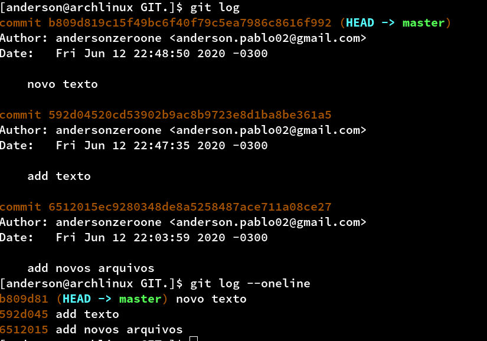
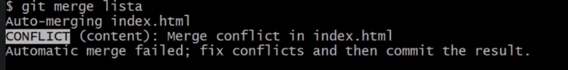

# Git


* [Para que serve o Git?](#Para-que-serve-o-Git);   
* [instalação](#Instalação);
* [Configurando o  user](#Configurando-o-user);
* [Inicialização criando um novo repositório](#Inicialização-criando-um-novo-repositório);
* [Monitorando arquivos](#Monitorando-arquivos);
* [Historico de alterações](#Historico-de-alterações); 
* [Git ignore](#Git-ignore); 
* [Repositório remoto](#Repositório-remoto); 
* [Clonando repositório ](#Clonando-repositório); 
* [Branches](#Branches); 
* [Resolvendo conflitos](#Resolvendo-conflitos);
* [Git stash](#Git-stash);
* [Voltando para um commit antigo](#Voltando-para-um-commit-antigo);

### Para que serve o Git ?

É comum quando se trabalho com desenvolvimento, trabalhar com mais de uma pessoa no mesmo projeto. E com isso cada pessoa tem o projeto em sua maquina e as mesmas faram alterações ao logo do desenvolvimento. Quando uma  pessoa faz uma alteração no projeto, as outras precisam ser notificadas sobre o enviou dessas alterações, o envio por meios físicos como pendrives, HD externo não seria muito interessante até por que no momento da entrega de uma alteração outra já poderia ter sido feita. Essa situação séria um pouco confuso e poderia trazer alguns problemas durante o desenvolvimento, por isso existi algumas soluções e uma dela é a criação de um servidor específico para o envio das alterações dos arquivos onde todos da equipe tem acesso a este servidor.
O servidor precisa ter alguma ferramenta capaz de identificar que a versão enviada não é a mais recente e não permitir o envio do projeto sem antes o usuário baixar a atual versão do projeto já que antes do envio das suas alterações ocorreram uma ou mais alterações no projeto. Isso é chamado de controle de versão. E é isso que o GIT faz, mas existem outros sistemas de controle de versão como:

* CVS
* SVN
* Mercurial
* GIT


O Git é o mais utilizado por conta de  algumas características vantajosas, como permitir uma cópia do projeto, um repositório do projeto em sua máquina, para que se possa trabalhar em cima dela e então enviá-lo para outro repositório, o que se denomina repositórios distribuídos.

## Instalação 

Para instalar basta acessar o [site oficial](https://git-scm.com/downloads)

```css
Caso você esteja utilizando Linux, algumas distribuições já vêm com o Git instalado, então é só abrir o Terminal e digitar "git  --version" para verificar isto. Se ele não estiver instalado, use  o gerenciador de pacotes da sua distribuição.
```

Feito o download, executaremos o arquivo, e durante a instalação, existem algumas opções  como o "Git Bash" , que é uma forma de digitar comandos. O Git Bash fornece comandos com os quais quem desenvolve em Linux já está acostumado a usar, como o ls para mostrar arquivos e pastas existentes no diretório atual.

A instalação padrão é clicando em "Next". Em "Adjusting your PATH environment", é possível definir se iremos usar apenas o Git Bash, ou então o Git de qualquer outra interface de linha de comando podem deixar padrão caso queira outra opção basta ler atentamente as opções.

Finalizada a instalação, podem desmarcar o box de "View Release Notes" e marcar "Launch Git Bash", para que se inicie a execução do Git Bash.
para garantir que tudo ocorreu bem no terminal digiti git --version, ao que será retornado git e a versão instalada.

## Configurando o  user 

Antes de utilizar o git precisa informa quem é o usuário para que ele possa salvar os dados do autor das alterações.

```css

git config --local user.name "Seu nome aqui"
git config --local user.email "seu@email.aqui"


```
É possível configurar um e-mail e autoria para cada projeto ou para a maquina toda através do comando:

```css

    //configurando para o projeto
    config --local  user.name "seu nome"
    config --local  user.email "seu email"

    // para a maquina toda
    git config --global user.name "seu nome"
    config --local  user.email "seu email"
```

## Inicialização criando um novo repositório.

Para inicializar o repositório é preciso criar uma pasta com ou sem um projeto e executar o seguinte comando:

```css
    //comando
    git init.
```


Todas as alterações que forem realizadas no arquivo localizado dentro deste repositório poderão ser mostradas pelo Git com algumas informações como, indicações do que foi modificado, quem modificou e outras. No final após criar será adicionado o do Git Bash ((master)).

### Comando Status

Para verificar  o estado do repositório, ou analisar quais arquivos foram alterados use o comando git status.

```css
 //comando
  git status.
```


na mensagem será exibido algumas informações como, Untracked files, indica que há arquivos não monitorados no projeto, são arquivos que ainda não foram adicionados para o envio de uma nova atualização "commitar". para adcicionar esse arquivo é preciso utlizar o comando, git add nomeDoArquivo.

Ao executar o comando git status obetmos algumas informações como,HEAD, working tree e index e cada uma delas possui um definição.

HEAD: Estado atual do código.
working tree: Local onde os arquivos estão sendo armazenados e editados.
index: Local onde o Git armazena o que será commitado.

## Monitorando arquivos

Caso haja arquivos que nunca foi editado e salvo pelo Git, basta utilizar o comando git add:

```css

    git add nomeDoArquivo

    //se caso houver mais de um arquivo use

    git add .

// com o ponto no final

```


Com isso, se rodar o git status, irá aparecer um retorno, incluindo Changes to committed, isto é, "mudanças a serem commitadas", ou salvas, enviadas.

Para salvar as modificações é preciso rodar comando git commit porém precisamos informa uma descrição de qual modificação estamos fazendo para isso é preciso incluir o -m no final do comando mais a mensagem.

```css

     git commit -m "mesagem de descrição"
    // a mensagem precisa está entre aspas duplas e ser a mensagem deve ser descritiva e curta

```


Após executar o comando será exibido a mensagem que configuramos e será mostrado quais foram as alterações.Se executarmos git status novamente irá mostrar que não há nada para ser commitado.

Os commites devem serem feitos quando houver alterações significativas ou algum ponto que você quer lembrar. Não é recomendado executar commit quando algo no codigo não funciona, algumas pessoas defendem o uso do commit apesar no final do expediente outras dizem que devem ser feitos a cada alteração, não existi uma regra, e sim recomendações.

## Histórico de alterações

Poderemos verificar o histórico de alterações, cada mensagem de commits feitos, o comando que poderemos utilizar para isto é git log, que nos mostrará diversas informações, sendo o primeiro deles um hash do commit, uma identificação única de cada commit, não existem dois commits com o mesmo hash.
A informação seguinte refere se ao branch, ou "ramo" em que o commit se encontra. O HEAD e master quer dizer que é o local onde nos encontramos, no código, onde acontecem as alterações que fizermos, e que estamos em um ramo denominado master. Além de informações da autoria do commit, e-mail configurado, data do commit e mensagem.




O comando git log possui algumas variações:

    * git log --oneline: exibir as informações por linhas;
    * git log -p: exibir mais informações.

Para filtros em log cheatsheet há vários delas como:

    * git log --pretty="format:%H": traz apenas o hash;
    * git log --pretty="format:%h %s": traz o hash resumido seguido pela mensagem do commit.

É possível personalizar o comando de diversas formas de acordo com suas necessidades, é possível acessar mais opções usando o comando git log --help ou acessando [git log cheatsheet](https://devhints.io/git-log).

## Git ignore

Quando temos um arquivo no projeto que não desejamos fazer commit podemos ignorar através da criação de um arquivo chamado ".gitignore" dentro da pasta do projeto(o arquivo pode ser criado diretamente pela IDE).Todas as linhas que estiver dentro dele seram ignoramos pelo git durante o commit, exemplo.

Se quisermos ignorar um arquivo basta abrir o aquivo .gitinore e adicionar o nome do arquivo, se for pasta adicionar o nome da com uma barra no final.


## Repositório remoto

O repositório remoto é um servidor local onde podemos enviar alterações e as mesmas ficaram acessíveis para outras pessoas. Para isso é preciso criar uma pasta e pelo terminal acessar a pasta e rodar o comando:

```css
    git init --bare
```

Indicando que esse repositório contém apenas as alterações dos arquivos e não uma cópia física de cada um dos arquivos.Aṕos a criação do repositótio o git fornece um caminho de onde foi criado. é preciso
copiar o caminho indicado na tela e retornar pelo terminal para a pasta na qual foi criado o projeto. Para que o servidor reconheça o repositório precisa seguir alguns passos.

O primeiro passo é roda o comando mais o caminho do servidor:

```css
    git remote add local C:/Users/Documents/git-e-github
```

Se execultar ocomando git remote irá exibir todos os repositórios locais.
No local do caminho do servidor podemos informar uma URL de um servidor remoto ou o endereço de uma maquina na rede, qualquer endereço válido para um repositório Git.

Após executar o comando git remote add local podemos rodar o comando git remote -v para exibir o endereço local do repositório. Além disso aparecerá informações como de onde os dados desse caminho serão buscado (fetch), e para onde serão enviados (push). Em alguns casos poderá buscar os dados de um local e enviar para outro.

## Clonando repositório

Dentro de uma nova pasta é possível clonar o repositório do servidor através do comando git clone mais o caminho do servidor e o nome da pasta que será criada ex:

```css
    git clone C:/Users/Documents/servidor copiaProjeto
```

Isso fará com que essa nova pasta tenha acesso às novas alterações do projeto dentro da pasta copiaProjeto.

Caso a pasta esteja vazia é porque ainda não tive o envio de alterações. Depois dessas alterações enviadas através do commit, basta executar o comando git pull local master.

## Branches

Em um trabalho compartilhado tem dois usuários ou mais usuários trabalhando no mesmo projeto e em partes diferentes e o master está sendo compartilhado entre eles, para evitar complicações é interessante ter uma maneira de separar em ramos de desenvolvimento(branches) para saber exatamente no que cada um está trabalhando.

Por padrão, se executar git branch no Git Bash, terá um único branch, master, e é exatamente isto que o Git Bash mostra ao fim da linha. Para criar uma brache execute o comando, git branch nomeDaBranche, que criará este branch, embora tenha que mudar para ela manualmente, com git checkout nomeDaBranche.

Você pode visualizar isso de forma dinâmica pelo [Visualizing Git](https://git-school.github.io/visualizing-git/).


### Unindo trabalhos

È possível unir as ramificações (branch) do projeto através do comando git merge nomeDaBranch asim que ela ou outra branch esteja finalizada, ou feita alguma correção.Exemplo, após criar a branch titulo, entra na branch é feito dois commit, acessando a branch master e fazendo uma alteração no final é possível unir essas duas branch.


### Atualizando a branch

Durante atualização da branch podem gerar um commit a mais e dependendo da estratégia utilizada para gerar os commits, podem poluir o histórico de commits. Por isso é preciso atualizar a branch master com os commits de outras branch usando o comando git rebase nomeDaBranch.O comando git rebase atualiza a branch e junta as branch gerando apenas um commit de junção.


É possível fazer um teste no [Visualizing Git](https://git-school.github.io/visualizing-git/#free) seguindo alguns passos:


```css
    clear
    // caso não tenha a branch criada execute:  git branch titulo
    git checkout -b titulo
    git commit -m "teste1"
    git commit -m "teste2"
    git checkout master
    git rebase titulo
    git log

```
Resultado.


## Resolvendo conflitos

No momento de executar o comando git merge houver conflitos devido a uma falha no merge automático é recomendado corrigir primeiramente os conflitos e depois realizar o commit.



Já no código irá aparecer linhas como  <<<<<<< HEAD (Current Change) e =======, onde estão o atual commit no master. E  ======= e >>>>>>> lista (Incoming Change), são os dados que estamos tentando trazer da branch lista. Ou seja, é exibida exatamente a diferença entre ambos. E que precisamos fazer para corrigir este conflito é remover as informações indesejadas.


Após editar e salvar o arquivo executar o git status para verificar as informações dos arquivos modificados e em seguida executar git add nomeDoArquivo e depois o git commit para que o commit de merge seja realizado para enviar os arquivos execute git push local master.

## Ctrl + Z no Git

#### Desfazer alterações em arquivos não marcados para commit (git add).
Quando queremos desfazer alguma ação no git é preciso verificar algumas situações como por exemplo, se tem algo marcado para commit através do git add. Se ainda não foi utilizado o git add para commit o arquivo basta utilizar o comando git checkout -- nomeDoArquivo.

```css
    git checkout -- nomeDoArquivo
```

#### Desfazer alterações em arquivos marcados para commit (git add).

Para desfazer modificações que foram marcadas para commit usando o git add, com o git status é possível verificar quais arquivos estão marcados, para mudar isso é preciso executar git reset HEAD seguido do nome do arquivo a ser desmarcado. O HEAD indica para qual estado voltara o arquivo nesse caso voltará para o local onde ainda estamos trabalhando, se execultar o git status irá verificar que não possui arquivos a serem comitados para desfazer as alterações execute git checkout -- nomeDoArquivo.

#### Desfazer alterações em arquivos depois do commit.

Para desfazer alterações que sofreram commit é necessário identificar o hash(identificação única) do commit através do comando git log, após copiar a hash , use juntamente com o comando git revert use a hash dessa forma será criado um commit com as alterações desfeitas.

```css
    git revert b809d819c15f49bc6f40f79c5ea7986c8616f992 
```

## Git stash

No git é possível salvar um ponto de alteração temporário sem necessidade de commit, podendo salvar uma parte do projeto e da continuidade em outro ponto. Isso devido a um conceito chamado Stash, com ele conseguimos salvar todas as alterações em um local temporário sem precisar de um commit. O stash possui alguns comandos como:

Salvar as alterações em um local temporário;

```css
    git stash  
```
 Mostra a lista de pontos salvos.

```css
    git  stash list 
```

Para voltar a trabalhar com esses pontos salvos é preciso executar o git stash list e identificar pelo número da stash quer retornar.
Depois aplicar o comando git stash apply e o número da stash. Dessa forma irá aplicar as modificações, porém, esse ponto ainda ficará no stash list, para deleter execute git stash drop.

```css
    git stash apply 0 //aplicar modificação salva
    git stash drop // deletar da lista de stash list
```

## Voltando para um commit antigo

No git é possível retornar para um commit anteriores, sendo necessário apenas identificar o seu hash através do comando git log --oneline, o hash nesse comando exibir apenas os sete primeiros dígitos que já é suficiente para identificar o commit pelo hash.


Para acessar um commit basta executar git checkout ea539b3, assim estará acesso o commit indica. Porém, dessa forma as alterações feitas nesse local não serão salvas quando retorna para a master por que ele não gera uma nova branch. Observe na imagem que ao acessar o segundo commit com a hash ea539b3e e retorna para o master as alterações não foram salvas.

Acessando o commit


Retornando para o master:


Para salvar essas alterações quando retorna para o master é preciso acessar o commit desejado com o comando git checkout e em seguida criar uma branch com isso os commits serão salvos quando voltar para o master:


Agora quando quiser retornar a trabalha com a branch criada basta rodar o comando git checkout.


Fonte:
 * https://git-scm.com/docs/git-init;
 * https://git-scm.com/book/pt-br/v2;
 * http://bacana.one/como-usar-o-git-com-varios-repositorios-remotos;
 * https://rogerdudler.github.io/git-guide/index.pt_BR.html;
